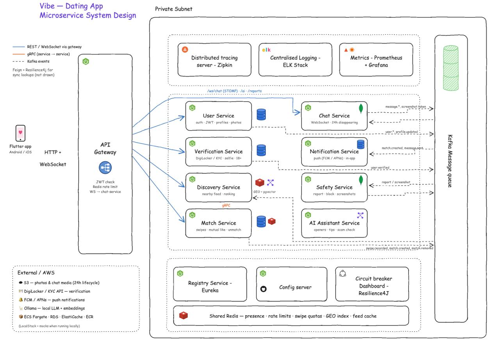
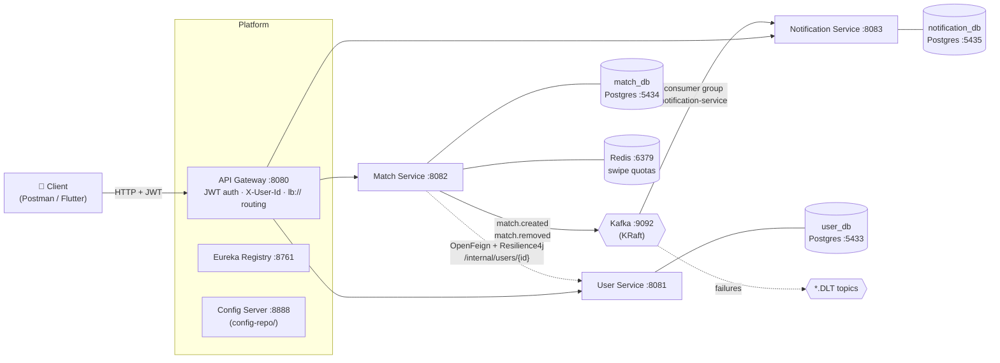
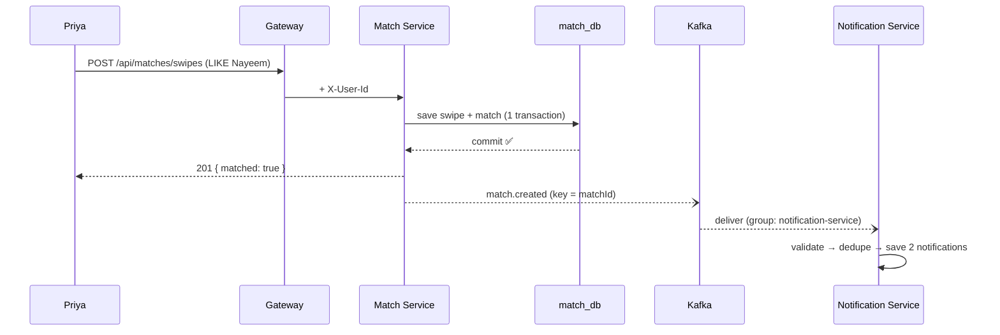

# SoftLaunch 💘

> A dating platform built as a **cloud-native microservice system** with Java 25, Spring Boot 4, Spring Cloud, Kafka, PostgreSQL and Redis.


SoftLaunch is a learning-driven, production-style backend for a modern dating app: sign up, build a rich profile, swipe, match, and get notified. Every service owns its own data. Services find each other through a registry, and they talk synchronously (REST + OpenFeign) when they need an answer now and asynchronously (Kafka events) when they don't.

---

## Table of Contents
- [Architecture](#architecture)
- [Tech Stack](#tech-stack)
- [Project Status](#project-status)
- [Services](#services)
- [Event-Driven Flow](#event-driven-flow)
- [Key Engineering Decisions](#key-engineering-decisions)
- [API Reference](#api-reference)
- [Getting Started](#getting-started)
- [Repository Layout](#repository-layout)
- [Roadmap](#roadmap)

---

## Architecture



The diagram above is the **target design**. The view below shows what is **running today**:



**Legend:** solid arrows are synchronous REST, dotted arrows are internal or service-to-service calls, and the arrows through Kafka are asynchronous events.

---

## Tech Stack

| Layer | Technology |
|---|---|
| Language / Runtime | Java 25 |
| Framework | Spring Boot 4.1, Spring Framework 7 |
| Service discovery | Spring Cloud Netflix Eureka |
| Central configuration | Spring Cloud Config Server (native, `config-repo/`) |
| Edge | Spring Cloud Gateway (reactive / WebFlux) |
| Security | JWT (jjwt 0.12, HS256), BCrypt |
| Persistence | Spring Data JPA, Hibernate 7, PostgreSQL 17 (one database per service) |
| Caching / counters | Redis 7 |
| Sync communication | OpenFeign + Spring Cloud LoadBalancer |
| Fault tolerance | Resilience4j circuit breaker + time limiter |
| Messaging | Apache Kafka 4 (KRaft, no ZooKeeper), Spring for Apache Kafka |
| Serialization | Jackson 3 (`tools.jackson`) |
| Validation | Jakarta Bean Validation (Hibernate Validator) |
| Error format | RFC 9457 `ProblemDetail` |
| Build | Maven |
| Local infrastructure | Docker Compose |
| API testing | Postman (collection variables, auto-saved token, scripted UUIDs) |

---

## Project Status

| Phase | Scope | Status |
|---|---|---|
| 1 | Platform backbone: Eureka, Config Server, API Gateway | ✅ Done |
| 2 | User Service: signup/login, BCrypt, JWT, validation, ProblemDetail | ✅ Done |
| 2.5 | Rich profiles: bio, intents, interests, hangouts, prompts, lifestyle, completion % | ✅ Done |
| 3 | Gateway security: JWT filter, `X-User-Id` propagation, header anti-spoofing | ✅ Done |
| 4 | Match Service: swipes, mutual-like matching, unmatch, Redis daily quota, Feign + circuit breaker | ✅ Done |
| 5 | Kafka events: `match.created`, Notification Service, idempotency, retries + DLT, event validation | ✅ Done |
| 5 | `match.removed`: clear stale notifications on unmatch | 🚧 In progress |
| 3+ | Redis rate limiting at the gateway | 📋 Planned |
| 6 | Discovery Service: Redis GEO nearby feed, ranking, gRPC to Match | 📋 Planned |
| 7 | Chat Service: WebSocket/STOMP, MongoDB, 24h disappearing messages | 📋 Planned |
| 8 | Verification (KYC / DigiLocker mock, 18+) and Safety (report, block, screenshots) | 📋 Planned |
| 9 | Observability: Zipkin, Prometheus + Grafana, centralised logging | 📋 Planned |
| 10 | AI Assistant: openers, tips, scam detection (Ollama + pgvector) | 📋 Planned |
| 11 | Media and cloud: S3 (LocalStack), Dockerfiles, one-command startup | 📋 Planned |
| 12 | Flutter client | 📋 Planned |

---

## Services

### 🧭 Registry Service (`:8761`)
Eureka server. Every service registers here, and the gateway and Feign clients resolve `lb://service-name` through it.

### ⚙️ Config Server (`:8888`)
Serves configuration from `config-repo/` in native mode. Shared settings live in `application.yaml` and per-service settings in `<service>.yaml`. Services fail fast if the Config Server is unreachable.

### 🚪 API Gateway (`:8080`)
- Single entry point for all clients
- A global JWT filter validates the token and forwards the caller's identity as `X-User-Id`
- Strips any client-supplied `X-User-Id` header, which prevents identity spoofing
- Public paths: `/api/users/auth/**`
- `/internal/**` endpoints are **never** routed, so they are reachable only service-to-service

### 👤 User Service (`:8081`, `user_db`)
- Signup and login with BCrypt, issuing a short-lived JWT (15 min)
- **Constant-time login:** a dummy hash comparison for unknown emails, which defeats timing-based user enumeration
- Custom `@Adult` validator (18+ only)
- Rich profile: bio, relationship intents (long-term, short-term, casual, and more), interests, favourite hangout places, prompts, lifestyle habits, and a profile completion percentage
- Public profile endpoint with an allow-list DTO, so no private fields leak
- `/profile-options` endpoint so clients can render pickers from server-side enums
- Internal endpoint `/internal/users/{id}`, used by the Match Service

### 💞 Match Service (`:8082`, `match_db` + Redis)
- `LIKE` / `PASS` / `SUPER_LIKE` swipes with a unique `(swiper, target)` constraint
- Mutual like creates a `Match` stored as a **sorted user pair**, so A↔B and B↔A can never create duplicates (race-safe through a DB constraint)
- Daily swipe quota with a Redis `INCR` + TTL, returning **429** when exceeded
- Verifies that the target user exists through **OpenFeign**, protected by a **Resilience4j circuit breaker**:
  - a 404 is not counted as a failure
  - returns 503 when User Service is unavailable
- Publishes `match.created` and `match.removed` **after the DB transaction commits**

### 🔔 Notification Service (`:8083`, `notification_db`)
- Consumes Kafka events and stores in-app notifications for **both** users in a match
- **Idempotent:** a unique `(source_event_id, recipient_id)` key means a redelivered event never creates a duplicate
- Validates events (`@NotNull` fields) and rejects bad ones immediately, without retrying
- Retries temporary failures (2 retries, 1s apart), then routes to a **Dead Letter Topic** with full error headers
- `GET /api/notifications`, `PATCH /api/notifications/{id}/read` (ownership-checked)

---

## Event-Driven Flow



| Topic | Producer | Consumer(s) | Key | Partitions |
|---|---|---|---|---|
| `match.created` | Match Service | Notification Service | `matchId` | 3 |
| `match.removed` | Match Service | Notification Service | `matchId` | 3 |
| `match.created.DLT` / `match.removed.DLT` | Error handler | Ops / manual replay | original | 3 |

**Proven behaviours:**
- **Resilience:** with Notification Service stopped, matching still succeeds. On restart, the service catches up from its committed offset and no events are lost.
- **Late joiner:** a brand-new consumer group with `auto-offset-reset: earliest` processes the event history.
- **Poison pills:** invalid JSON or invalid events go to the DLT once, and the partition keeps flowing.

---

## Key Engineering Decisions

| Decision | Why |
|---|---|
| **Database per service** | Services deploy and scale independently, with no hidden coupling through shared tables |
| **Gateway-terminated JWT** | Downstream services trust `X-User-Id` and don't each re-implement auth |
| **`@TransactionalEventListener(AFTER_COMMIT)`** | Never publishes an event for data that was rolled back (mitigates the dual-write problem; an outbox is planned) |
| **`matchId` as the Kafka key** | All events for one match land on the same partition, so they're processed in order |
| **Sync for queries, async for side effects** | Feign is used when the answer is needed now (does the user exist?). Kafka is used when the work can happen later (notifications), so one service being down doesn't break the others |
| **Idempotent consumers** | Kafka is at-least-once, so duplicates are expected and harmless |
| **Fail fast on permanent errors** | Validation and JSON errors skip retries and go straight to the DLT |
| **DB constraints as a safety net** | Unique keys guard against races that application checks alone can't catch |
| **`ProblemDetail` everywhere** | Consistent, machine-readable error responses |

---

## API Reference

All requests go through the gateway at `http://localhost:8080`. Endpoints marked 🔒 require `Authorization: Bearer <token>`.

### Auth & Users
| Method | Endpoint | Description |
|---|---|---|
| POST | `/api/users/auth/signup` | Create an account (18+) |
| POST | `/api/users/auth/login` | Get a JWT |
| GET 🔒 | `/api/users/me` | Current user |
| GET 🔒 | `/api/users/me/profile` | My full profile + completion % |
| PUT 🔒 | `/api/users/me/profile` | Create or update my profile |
| GET 🔒 | `/api/users/{userId}/profile` | Someone's public profile |
| GET 🔒 | `/api/users/profile-options` | Enum options for intents, interests and habits |

### Matches
| Method | Endpoint | Description |
|---|---|---|
| POST 🔒 | `/api/matches/swipes` | Swipe `{ targetUserId, direction }` → `201 { matched, matchId }` |
| GET 🔒 | `/api/matches` | My matches |
| DELETE 🔒 | `/api/matches/{matchId}` | Unmatch → `204` |

### Notifications
| Method | Endpoint | Description |
|---|---|---|
| GET 🔒 | `/api/notifications` | My notifications (newest first) |
| PATCH 🔒 | `/api/notifications/{id}/read` | Mark as read |

**Common errors:** `400` validation · `401` missing or invalid token · `404` not found · `409` already swiped · `429` daily swipe limit · `503` dependency unavailable

---

## Getting Started

### Prerequisites
- JDK 25
- Maven 3.9+
- Docker Desktop

### 1. Start the infrastructure
```bash
docker compose up -d
```
This starts PostgreSQL ×3 (`5433`, `5434`, `5435`), Redis (`6379`) and Kafka (`9092`).

### 2. Start the services, in this order
```bash
cd registry-service      && mvn spring-boot:run   # 1. :8761
cd config-server         && mvn spring-boot:run   # 2. :8888
cd api-gateway           && mvn spring-boot:run   # 3. :8080
cd user-service          && mvn spring-boot:run   # 4. :8081
cd match-service         && mvn spring-boot:run   # 5. :8082
cd notification-service  && mvn spring-boot:run   # 6. :8083
```
Run each command in its own terminal. Wait about 30–60s for the services to register, then check the Eureka dashboard at http://localhost:8761.

### 3. Try it
```bash
curl -X POST http://localhost:8080/api/users/auth/signup \
  -H "Content-Type: application/json" \
  -d '{"name":"Test User","email":"test@example.com","password":"supersecret123","dateOfBirth":"2000-01-01"}'
```

### Useful Kafka commands
```bash
# List topics
docker exec -it softlaunch-kafka /opt/kafka/bin/kafka-topics.sh --bootstrap-server localhost:9092 --list

# Watch match events
docker exec -it softlaunch-kafka /opt/kafka/bin/kafka-console-consumer.sh \
  --bootstrap-server localhost:9092 --topic match.created --from-beginning --property print.key=true

# Consumer lag
docker exec -it softlaunch-kafka /opt/kafka/bin/kafka-consumer-groups.sh \
  --bootstrap-server localhost:9092 --describe --group notification-service
```

> ⚠️ **Security note:** the secrets in `config-repo/` (DB passwords, the JWT signing key) are **local development values only**. In any real deployment they must come from a secret manager or environment variables.

---

## Repository Layout

```
softlaunch/
├── docker-compose.yml        # Postgres ×3, Redis, Kafka
├── config-repo/              # Centralised config served by Config Server
│   ├── application.yaml      #   shared (Eureka, instance id)
│   ├── api-gateway.yaml      #   routes + JWT
│   ├── user-service.yaml
│   ├── match-service.yaml
│   └── notification-service.yaml
├── registry-service/         # Eureka server
├── config-server/            # Spring Cloud Config
├── api-gateway/              # Spring Cloud Gateway + JWT filter
├── user-service/             # Auth + profiles
├── match-service/            # Swipes, matches, quotas, events
└── notification-service/     # Kafka consumer + in-app notifications
```

---

## Roadmap

- [x] Platform backbone (Eureka, Config, Gateway)
- [x] Auth with JWT + BCrypt, rich profiles
- [x] Swipes, matching, unmatch, Redis quotas
- [x] OpenFeign + Resilience4j circuit breaker
- [x] Kafka `match.created` → notifications (idempotent, DLT, validated)
- [ ] `match.removed` → clear notifications *(in progress)*
- [ ] Gateway rate limiting (Redis)
- [ ] Transactional outbox pattern
- [ ] Discovery Service: Redis GEO feed + gRPC
- [ ] Chat Service: WebSocket/STOMP + MongoDB TTL
- [ ] Verification and Safety services
- [ ] Distributed tracing, metrics and centralised logs
- [ ] AI Assistant (Ollama, pgvector)
- [ ] Dockerised services, S3 media, cloud deployment
- [ ] Flutter mobile client

---

## Author

**Shaik Nayeem Basha** · building in public, one service at a time.

⭐ If you find this project useful or interesting, consider giving it a star!
